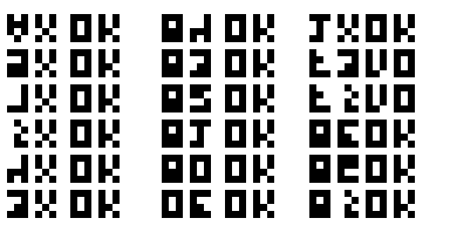
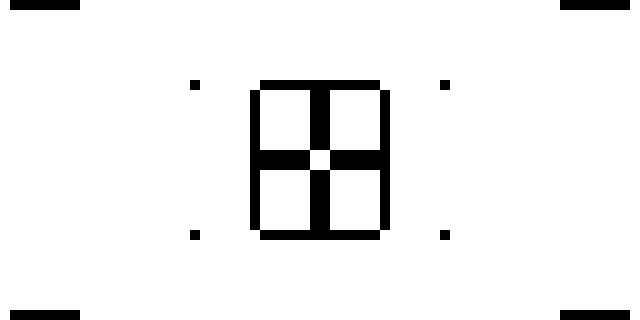

    ---

# CHIP-8 Emulator

A CHIP-8 emulator written in C++ using SDL2 for input handling and OpenGL for rendering. The emulator can load and run CHIP-8 ROMs, emulating their instructions and displaying the output as per the original specifications.

## Table of Contents

- [Overview](#overview)
- [Features](#features)
- [Installation](#installation)
- [Usage](#usage)
- [Controls](#controls)
- [Configuration](#configuration)
- [Demos](#demos)
- [Known Issues](#known-issues)

## Overview

CHIP-8 is an interpreted programming language, originally developed in the 1970s for simple video games. This emulator recreates the CHIP-8 environment, allowing users to load and run CHIP-8 ROMs, providing an authentic retro-gaming experience.

## Features

- **CHIP-8 Instruction Set**: Supports the full set of CHIP-8 opcodes.
- **SDL2 Input Handling**: Maps keyboard inputs to CHIP-8 keys.
- **OpenGL Rendering**: Fast and flexible rendering using OpenGL.
- **Game Configuration**: Easily configure emulator settings via `settings.ini`.
- **ROM Support**: Load and play any compatible CHIP-8 ROM.

## Installation

### Prerequisites

1. **SDL2**: Install SDL2 development libraries:
   - On Arch Linux:
     ```bash
     sudo pacman -S sdl2
     ```

2. **OpenGL**: Ensure OpenGL libraries are installed:
   - On Arch Linux:
     ```bash
     sudo pacman -S mesa
     ```

### Build Instructions

1. Clone the repository:
   ```bash
   git clone https://github.com/AakashR13/CHIP-8_Emulation.git
   cd CHIP-8_Emulation
   ```

2. Build the project using `make`:
   ```bash
   make
   ```

3. Run the emulator:
   ```bash
   make run
   ```

## Usage

### Running a ROM

1. Place your CHIP-8 ROM file in the `roms/` directory.
2. Update the `settings.ini` file with the ROM name (see [Configuration](#configuration)).
3. Launch the emulator:
   ```bash
   make run
   ```

### Emulator Controls

Keypad                   Keyboard
+-+-+-+-+                +-+-+-+-+
|1|2|3|C|                |1|2|3|4|
+-+-+-+-+                +-+-+-+-+
|4|5|6|D|                |Q|W|E|R|
+-+-+-+-+       =>       +-+-+-+-+
|7|8|9|E|                |A|S|D|F|
+-+-+-+-+                +-+-+-+-+
|A|0|B|F|                |Z|X|C|V|
+-+-+-+-+                +-+-+-+-+

### Controls

- **ESC**: Exit the emulator.
- **Other keys**: The emulator maps the CHIP-8 keys to your keyboard as shown above.

## Configuration

The emulator uses a `settings.ini` file to configure the ROM to load and other emulator settings. Below is an example configuration:

```ini
RomName: roms/test_opcode.ch8
OpcodesPerSecond: 700
```

- **RomName**: Specifies the ROM file to load from the `roms/` directory.
- **OpcodesPerSecond**: Determines the speed at which the CPU processes instructions.

## Demos
### test_opcode



### Kaleidoscope



## Known Issues

- Some ROMs may not run correctly due to incomplete opcode implementations.
- Performance may vary depending on your system and OpenGL support.

---