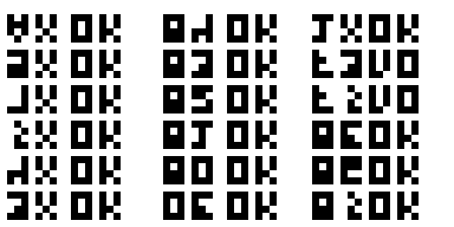
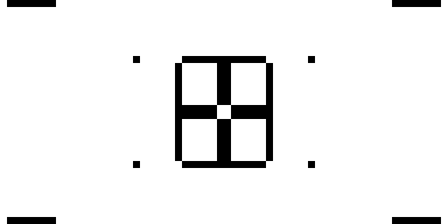

---
tags:
  - domain/build
  - type/project
  - type/project
  - domain/build
  - type/project
  - domain/build
default_tag: "#project/README"
status: status/completed
---
# CHIP-8 Emulator

A CHIP-8 emulator written in C++ using SDL2 for input handling and OpenGL for rendering.

 

## Overview

CHIP-8 is an interpreted programming language, originally developed in the 1970s for simple video games. This emulator recreates the CHIP-8 environment, allowing users to load and run CHIP-8 ROMs, providing an authentic retro-gaming experience.

The emulator can load and run CHIP-8 ROMs, emulating their instructions and displaying the output as per the original specifications.

## Features

- 🎮 **Full CHIP-8 Instruction Set** - Supports the complete set of CHIP-8 opcodes
- ⌨️ **SDL2 Input Handling** - Maps keyboard inputs to CHIP-8 keys
- 🖥️ **OpenGL Rendering** - Fast and flexible rendering using OpenGL
- ⚙️ **Configurable Settings** - Easily configure emulator settings via `settings.ini`
- 💾 **ROM Support** - Load and play any compatible CHIP-8 ROM

## Installation

### Prerequisites

- **SDL2** development libraries
  - Arch Linux: `sudo pacman -S sdl2`
  - Ubuntu/Debian: `sudo apt-get install libsdl2-dev`
  - macOS: `brew install sdl2`
- **OpenGL** libraries
  - Arch Linux: `sudo pacman -S mesa`
  - Usually pre-installed on most systems

### Building

1. **Clone the repository:**
   ```bash
   git clone https://github.com/AakashR13/CHIP-8_Emulation.git
   cd CHIP-8_Emulation
   ```

2. **Build the project:**
   ```bash
   make
   ```

3. **Run the emulator:**
   ```bash
   make run
   ```

## Usage

### Running a ROM

1. Place your CHIP-8 ROM file in the `roms/` directory
2. Update the `settings.ini` file with the ROM name (see Configuration)
3. Launch the emulator:
   ```bash
   make run
   ```

### Controls

The emulator maps CHIP-8 keypad to your keyboard:

```
CHIP-8 Keypad    Keyboard
+-+-+-+-+        +-+-+-+-+
|1|2|3|C|   =>   |1|2|3|4|
+-+-+-+-+        +-+-+-+-+
|4|5|6|D|   =>   |Q|W|E|R|
+-+-+-+-+        +-+-+-+-+
|7|8|9|E|   =>   |A|S|D|F|
+-+-+-+-+        +-+-+-+-+
|A|0|B|F|   =>   |Z|X|C|V|
+-+-+-+-+        +-+-+-+-+
```

- **ESC**: Exit the emulator

## Configuration

The emulator uses a `settings.ini` file to configure settings:

```ini
RomName: roms/test_opcode.ch8
OpcodesPerSecond: 700
```

- **RomName**: Specifies the ROM file to load from the `roms/` directory
- **OpcodesPerSecond**: Determines the CPU instruction processing speed

## Project Structure

```
CHIP-8_Emulation/
├── src/          # Source files
├── bin/          # Compiled binaries
├── roms/         # CHIP-8 ROM files
├── images/       # Screenshots/demos
├── Makefile      # Build configuration
└── settings.ini  # Emulator configuration
```

## Language Distribution

- **C++**: 96.2% - Core emulator implementation
- **Makefile**: 3.8% - Build configuration

## Demos

The emulator includes demo ROMs with screenshots:

### test_opcode



### Kaleidoscope



## Known Issues

- Some ROMs may not run correctly due to incomplete opcode implementations
- Performance may vary depending on your system and OpenGL support

## References

- [CHIP-8 - Wikipedia](https://en.wikipedia.org/wiki/CHIP-8)
- [CHIP-8 Technical Reference](http://devernay.free.fr/hacks/chip8/C8TECH10.HTM)
- [SDL2 Documentation](https://www.libsdl.org/)
- [OpenGL Documentation](https://www.opengl.org/)

## License

This project is licensed under the **MIT License**.

See the [LICENSE](https://github.com/AakashR13/CHIP-8_Emulation/blob/main/LICENSE) file in the repository for full license details.

